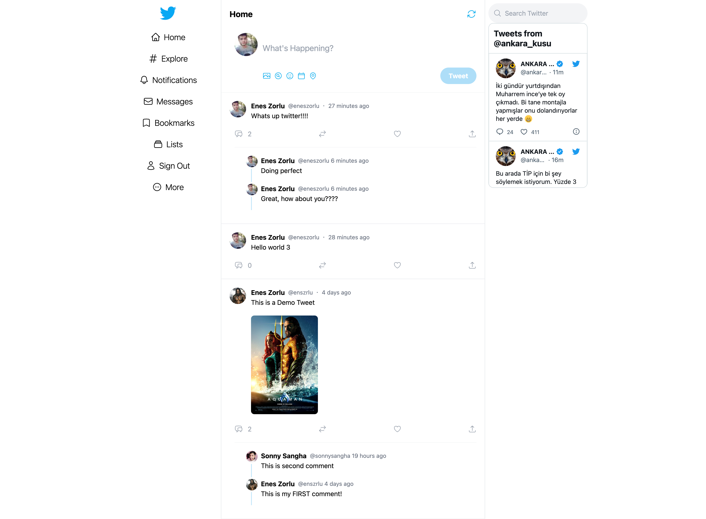
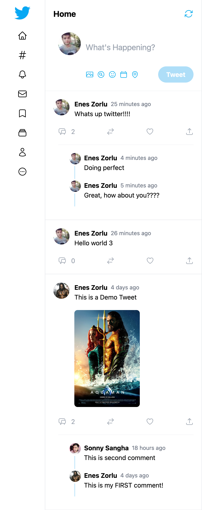

# Twitter Clone

This is a practice project to test different technologies I have learned.

## Table of contents

-   [Overview](#overview)
-   [Preview](#preview)
    -   [Links](#links)
-   [Author](#author)

## Overview

Basic Twitter with Twitter Auth

### Built with

-   Next.js & React.js
-   [tailwindcss](https://tailwindcss.com/) - CSS Framework
-   sanity.io
-   NextAuth.js

## Preview

### Links

-   Repo URL: [Solution](https://github.com/enszrlu/twitter-clone)
-   Live Site URL: [Live Site](XXXXXX)

## Author

-   Website - [github](https://github.com/enszrlu)
